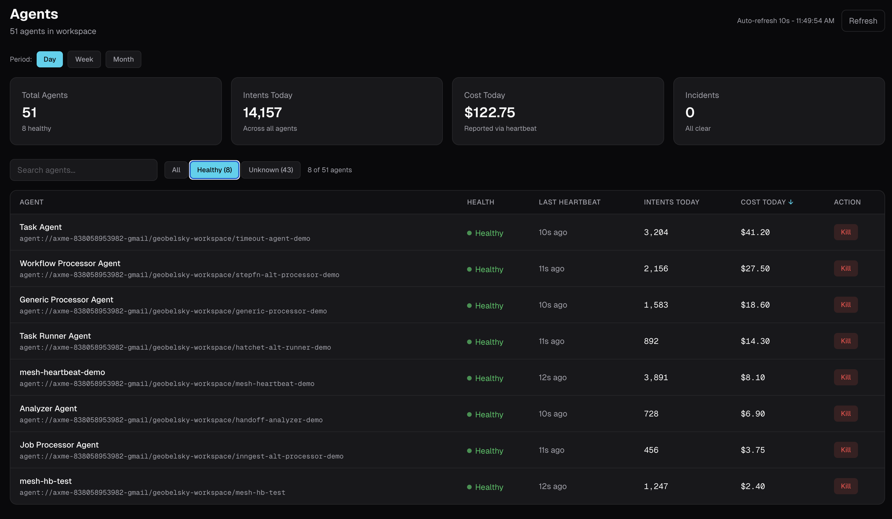

# AI Agent Heartbeat Monitoring

Your agent stopped responding 2 hours ago. Nobody noticed. AXME adds heartbeat monitoring with automatic health detection - one line to enable, zero infrastructure to manage.

AI agents fail silently. The process is running. The container is green. But the agent stopped processing intents 2 hours ago and nobody knows. AXME adds a heartbeat that runs in a background thread, reports liveness every 30 seconds, and automatically detects degraded and unreachable agents.

> **Alpha** - Built with [AXME](https://github.com/AxmeAI/axme) (AXP Intent Protocol).
> [cloud.axme.ai](https://cloud.axme.ai) - [contact@axme.ai](mailto:contact@axme.ai)

---

## The Problem

```
Your agent fleet - right now:

  agent-1 (order-processor)     last heartbeat: 2s ago     healthy
  agent-2 (inventory-sync)      last heartbeat: 45s ago    healthy
  agent-3 (report-generator)    last heartbeat: ???         ???
  agent-4 (email-responder)     last heartbeat: ???         ???

  Kubernetes says: 4/4 pods running
  CloudWatch says: no errors
  Your dashboard says: everything is fine

  Reality: agent-3 deadlocked 2 hours ago. agent-4 OOM-killed
  and restarted into a boot loop. Nobody knows.
```

Container health checks tell you the process is alive. They don't tell you the agent is working. An agent can pass every liveness probe while being completely stuck - waiting on a lock, blocked on a full queue, looping on a bad retry, or silently swallowing exceptions.

---

## The Solution



```python
from axme import AxmeClient, AxmeClientConfig
import os

client = AxmeClient(AxmeClientConfig(api_key=os.environ["AXME_API_KEY"]))

# One line. Background thread. 30s heartbeat. Automatic health detection.
client.mesh.start_heartbeat()
```

The platform computes health from heartbeat recency:

| Last Heartbeat | Health Status | Meaning |
|---|---|---|
| < 90 seconds | `healthy` | Agent is alive and reporting |
| 90 - 300 seconds | `degraded` | Agent may be stuck or overloaded |
| > 300 seconds | `unreachable` | Agent is down or not reporting |
| Manual kill | `killed` | Operator blocked this agent |

No cron jobs. No custom health-check endpoints. No Prometheus exporters. No PagerDuty webhooks. The platform detects the state transition and can trigger alerts, block intent delivery, or escalate to a human.

---

## Quick Start

```bash
pip install axme
export AXME_API_KEY="your-key"   # Get one: axme login
```

```python
from axme import AxmeClient, AxmeClientConfig
import os

client = AxmeClient(AxmeClientConfig(api_key=os.environ["AXME_API_KEY"]))

# Start background heartbeat (30s interval, daemon thread)
client.mesh.start_heartbeat()

# Your agent does its work...
for delivery in client.listen("my-agent"):
    handle_intent(client, delivery)

# Heartbeat stops automatically when process exits (daemon thread)
# Or stop explicitly:
client.mesh.stop_heartbeat()
```

---

## Before / After

### Before: DIY Heartbeat Monitoring

```python
import threading, time, requests

def heartbeat_loop(agent_id, interval=30):
    while True:
        try:
            requests.post(
                "https://your-monitoring.internal/heartbeat",
                json={"agent_id": agent_id, "timestamp": time.time()},
                timeout=5,
            )
        except Exception:
            pass  # Hope someone checks the monitoring DB
        time.sleep(interval)

# Start heartbeat thread
threading.Thread(target=heartbeat_loop, args=("my-agent",), daemon=True).start()

# Separately: cron job to detect missing heartbeats
# Separately: alerting rules in Prometheus/Grafana
# Separately: PagerDuty integration for escalation
# Separately: dashboard to show agent health
# Separately: logic to stop sending work to degraded agents
```

### After: AXME Heartbeat (built-in)

```python
client.mesh.start_heartbeat()
```

One line. Health detection, dashboards, alerting, and intent routing are all handled by the platform.

---

## How It Works

```
+-----------+   heartbeat (30s)   +----------------+
|           | ------------------> |                |
|   Agent   |   POST /v1/mesh/    |   AXME Cloud   |
|           |     heartbeat       |   (platform)   |
|           |                     |                |
|  (daemon  |                     |  Computes:     |
|  thread)  |                     |  - healthy     |
|           |                     |  - degraded    |
+-----------+                     |  - unreachable |
                                  |                |
+-----------+   GET /v1/mesh/     |  Returns:      |
|           |     agents          |  health per    |
| Operator  | <-----------------  |  agent         |
|  / CLI    |                     |                |
|           | axme mesh dashboard |  Actions:      |
|           | ------------------> |  - alert       |
|           |                     |  - block       |
+-----------+                     |  - escalate    |
                                  +----------------+
```

---

## Run the Full Example

### Prerequisites

```bash
curl -fsSL https://raw.githubusercontent.com/AxmeAI/axme-cli/main/install.sh | sh
axme login
pip install axme
```

### Terminal 1 - Start the agent with heartbeat

```bash
axme scenarios apply scenario.json
```

### Terminal 2 - Run the agent

```bash
cat ~/.config/axme/scenario-agents.json | grep -A2 heartbeat-demo
AXME_API_KEY=<agent-key> python agent.py
```

### Terminal 1 - Check health

```bash
# Open the dashboard to see all agents
axme mesh dashboard

# Or check health via Python:
# result = client.mesh.list_agents()
# Simulate failure: kill agent process (Ctrl+C in Terminal 2)
# Wait 90s -> health_status: degraded
# Wait 5 min -> health_status: unreachable
```

### Send heartbeat with metrics

```bash
AXME_API_KEY=<agent-key> python initiator.py
```

---

## Health States in Detail

### Healthy (< 90 seconds since last heartbeat)

Agent is alive and actively reporting. Intents are delivered normally. This is the default state when `start_heartbeat()` is running.

### Degraded (90 - 300 seconds since last heartbeat)

Agent may be stuck, overloaded, or experiencing network issues. The platform still delivers intents but can be configured to route around degraded agents. Operators are alerted.

### Unreachable (> 300 seconds since last heartbeat)

Agent is down. The platform stops delivering new intents to this agent. Pending intents can be rerouted to healthy agents or escalated to humans.

### Killed (manual operator action)

Operator explicitly killed the agent via `client.mesh.kill(address_id)` or the dashboard Kill button. All intent delivery is blocked. Agent stays killed until explicitly resumed with `client.mesh.resume(address_id)`.

---

## Heartbeat with Metrics

The heartbeat can carry operational metrics, flushed automatically with each pulse:

```python
client.mesh.start_heartbeat(include_metrics=True)

# Report metrics as your agent processes work
client.mesh.report_metric(success=True, latency_ms=234.5, cost_usd=0.003)
client.mesh.report_metric(success=False, latency_ms=5012.0)

# Metrics are buffered and sent with the next heartbeat automatically
```

The platform aggregates these metrics per agent and exposes them via `client.mesh.list_agents()` and the dashboard at [mesh.axme.ai](https://mesh.axme.ai).

---

## Related

- [AXME](https://github.com/AxmeAI/axme) - project overview
- [AI Agent Kill Switch](https://github.com/AxmeAI/ai-agent-kill-switch) - emergency stop for agents
- [AI Agent Cost Monitoring](https://github.com/AxmeAI/ai-agent-cost-monitoring) - track spend per agent
- [Agent Timeout and Escalation](https://github.com/AxmeAI/agent-timeout-and-escalation) - timeout + human escalation
- [AXME Examples](https://github.com/AxmeAI/axme-examples) - 20+ runnable examples

---

Built with [AXME](https://github.com/AxmeAI/axme) (AXP Intent Protocol).
